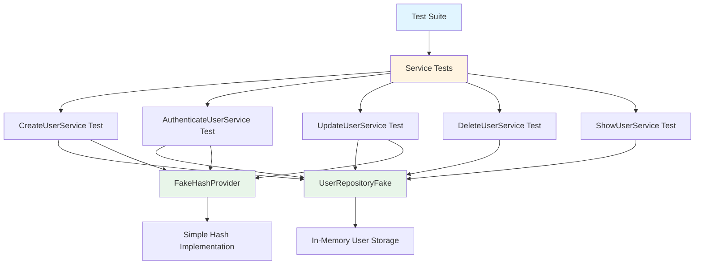

# Testing Documentation

This document provides comprehensive information about testing in the Sample Flask Authentication project.

## Table of Contents

1. [Overview](#overview)
2. [Quick Start](#quick-start)
3. [Running Tests](#running-tests)
4. [Test Coverage](#test-coverage)
5. [Test Reports](#test-reports)
6. [Running Specific Tests](#running-specific-tests)
7. [Test Markers](#test-markers)
8. [Understanding Test Results](#understanding-test-results)
9. [Test Architecture](#test-architecture)
10. [Writing New Tests](#writing-new-tests)
11. [Troubleshooting](#troubleshooting)
12. [CI/CD Integration](#cicd-integration)

---

## Overview

### Testing Philosophy

This project follows a comprehensive testing strategy focused on:
- **Unit Testing**: Testing individual service components in isolation
- **High Coverage**: Maintaining minimum 80% code coverage
- **Fast Execution**: Using fake implementations for quick test runs
- **Clear Documentation**: Well-documented test cases and assertions

### Testing Tools

The project uses the following testing frameworks and tools:

| Tool | Purpose | Documentation |
|------|---------|---------------|
| **pytest** | Main testing framework | [pytest.org](https://pytest.org) |
| **pytest-cov** | Code coverage measurement | [pytest-cov](https://pytest-cov.readthedocs.io) |
| **pytest-html** | HTML test reports | [pytest-html](https://pytest-html.readthedocs.io) |
| **allure-pytest** | Advanced reporting with trends | [allure](https://docs.qameta.io/allure/) |

### Coverage Goals

- **Minimum Coverage**: 80% for service layer
- **Target Files**: `src/modules/users/services/`
- **Enforcement**: Tests fail if coverage drops below threshold

---

## Quick Start

### Prerequisites

Ensure you have installed all dependencies:

```bash
pip install -r requirements.txt
```

### Run All Tests

```bash
# Basic test run
pytest

# With verbose output
pytest -v

# With coverage
pytest --cov

# Generate all reports
pytest --html=report.html --cov --alluredir=allure-results
```

### Expected Output

```
================================ test session starts =================================
platform darwin -- Python 3.x.x, pytest-8.3.4, pluggy-1.5.0
rootdir: /path/to/sample-flask-auth
configfile: pytest.ini
testpaths: src/modules/
plugins: cov-7.0.0, html-4.1.1, allure-pytest-2.15.0
collected 15 items

src/modules/users/tests/authenticate_user_service_test.py ..           [ 13%]
src/modules/users/tests/create_user_service_test.py ...                [ 33%]
src/modules/users/tests/delete_user_service_test.py ..                 [ 46%]
src/modules/users/tests/show_user_by_username_service_test.py ..       [ 60%]
src/modules/users/tests/update_user_service_test.py ...                [100%]

================================= 15 passed in 0.50s =================================
```

---

## Running Tests

### Basic Commands

```bash
# Run all tests
pytest

# Run with verbose output (shows each test name)
pytest -v

# Run with very verbose output (shows test details)
pytest -vv

# Run in quiet mode (minimal output)
pytest -q

# Stop on first failure
pytest -x

# Stop after N failures
pytest --maxfail=3
```

### Parallel Execution

For faster test execution (requires pytest-xdist):

```bash
# Install pytest-xdist
pip install pytest-xdist

# Run tests in parallel (auto-detect CPU cores)
pytest -n auto

# Run tests using 4 workers
pytest -n 4
```

### Watch Mode

For continuous testing during development (requires pytest-watch):

```bash
# Install pytest-watch
pip install pytest-watch

# Run tests on file changes
ptw
```

---

## Test Coverage

### What is Code Coverage?

Code coverage measures the percentage of your code that is executed during tests. It helps identify untested code paths and ensures comprehensive testing.

### Current Configuration

Coverage is configured in [`pytest.ini`](pytest.ini:1):

```ini
[pytest]
addopts = --cov=src/modules/users/services --cov-report=html --cov-fail-under=80
```

- **Target**: `src/modules/users/services/` (service layer)
- **Report Format**: HTML
- **Minimum Threshold**: 80%

### Generating Coverage Reports

```bash
# Run tests with coverage
pytest --cov

# Generate HTML coverage report
pytest --cov=src/modules/users/services --cov-report=html

# Generate terminal report with missing lines
pytest --cov=src/modules/users/services --cov-report=term-missing

# Generate XML report (for CI/CD)
pytest --cov=src/modules/users/services --cov-report=xml
```

### Viewing HTML Coverage Reports

After running tests with coverage, open the HTML report:

```bash
# macOS
open htmlcov/index.html

# Linux
xdg-open htmlcov/index.html

# Windows
start htmlcov/index.html
```

The HTML report shows:
- Overall coverage percentage
- Coverage by file
- Line-by-line coverage (green = covered, red = not covered)
- Branch coverage information

### Understanding Coverage Metrics

```
Name                                           Stmts   Miss  Cover   Missing
---------------------------------------------------------------------------
src/modules/users/services/create_user.py         15      2    87%   45-46
src/modules/users/services/authenticate.py        12      0   100%
---------------------------------------------------------------------------
TOTAL                                             27      2    93%
```

- **Stmts**: Total number of statements
- **Miss**: Number of statements not executed
- **Cover**: Coverage percentage
- **Missing**: Line numbers not covered

### Coverage Threshold

Tests will fail if coverage drops below 80%:

```
FAILED: coverage: total coverage is 75.00%, which is below the required threshold of 80.0%
```

To fix: Add tests for uncovered code paths.

---

## Test Reports

### HTML Reports

HTML reports are automatically generated as [`report.html`](report.html:1) after each test run.

#### Features:
- ✅ Self-contained (includes CSS/JS)
- ✅ Shareable (single file)
- ✅ Test duration statistics
- ✅ Failure details with stack traces
- ✅ Environment information

#### Viewing:

```bash
# macOS
open report.html

# Linux
xdg-open report.html

# Windows
start report.html
```

### Allure Reports

Allure provides advanced reporting with trends, history, and categorization.

#### Installation:

```bash
# Install allure-pytest (already in requirements.txt)
pip install allure-pytest

# Install Allure command-line tool
# macOS
brew install allure

# Linux
sudo apt-add-repository ppa:qameta/allure
sudo apt-get update
sudo apt-get install allure

# Windows (using Scoop)
scoop install allure
```

#### Generating Allure Reports:

```bash
# Run tests and generate allure results
pytest --alluredir=allure-results

# Serve the report (opens in browser)
allure serve allure-results

# Generate static HTML report
allure generate allure-results -o allure-report --clean
```

#### Allure Features:
- 📊 Test execution trends over time
- 📈 Historical data and comparisons
- 🏷️ Test categorization and tagging
- 📝 Detailed test steps and attachments
- ⏱️ Execution time analysis
- 🔄 Retry and flaky test detection

---

## Running Specific Tests

### By Test File

```bash
# Run all tests in a specific file
pytest src/modules/users/tests/create_user_service_test.py

# With verbose output
pytest -v src/modules/users/tests/create_user_service_test.py
```

### By Test Function

```bash
# Run a specific test function
pytest src/modules/users/tests/create_user_service_test.py::test_create_user

# Run multiple specific tests
pytest src/modules/users/tests/create_user_service_test.py::test_create_user \
       src/modules/users/tests/authenticate_user_service_test.py::test_login
```

### By Pattern Matching

```bash
# Run tests matching "create" in name
pytest -k "create"

# Run tests matching "create" or "update"
pytest -k "create or update"

# Run tests NOT matching "delete"
pytest -k "not delete"

# Complex pattern
pytest -k "create and not error"
```

### By Directory

```bash
# Run all tests in users module
pytest src/modules/users/tests/

# Run all tests in modules directory
pytest src/modules/
```

### Re-run Failed Tests

```bash
# Run only tests that failed in the last run
pytest --lf

# Run failed tests first, then others
pytest --ff
```

---

## Test Markers

Test markers allow you to categorize and selectively run tests.

### Available Markers

Configured in [`pytest.ini`](pytest.ini:4):

```ini
markers =
    smoke: mark a test as a smoke test.
    regression: mark a test as a regression test.
```

#### Smoke Tests
Critical functionality tests that should always pass. Run these before commits.

```python
@pytest.mark.smoke
def test_user_can_login():
    # Critical authentication test
    pass
```

#### Regression Tests
Tests that prevent previously fixed bugs from reoccurring.

```python
@pytest.mark.regression
def test_password_validation_bug_fix():
    # Test for a specific bug that was fixed
    pass
```

### Running Marked Tests

```bash
# Run only smoke tests
pytest -m smoke

# Run only regression tests
pytest -m regression

# Run smoke OR regression tests
pytest -m "smoke or regression"

# Run smoke AND regression tests
pytest -m "smoke and regression"

# Run all tests EXCEPT smoke tests
pytest -m "not smoke"
```

### Creating Custom Markers

Add to [`pytest.ini`](pytest.ini:4):

```ini
markers =
    smoke: mark a test as a smoke test.
    regression: mark a test as a regression test.
    slow: mark test as slow running.
    integration: mark test as integration test.
```

Usage:

```python
@pytest.mark.slow
def test_bulk_user_creation():
    # Test that takes longer to run
    pass
```

---

## Understanding Test Results

### Test Output Symbols

```
. (dot)     = Test passed
F (F)       = Test failed
E (E)       = Test error (exception during test)
s (s)       = Test skipped
x (x)       = Expected failure (xfail)
X (X)       = Unexpected pass (xpass)
```

### Successful Test Run

```
================================ test session starts =================================
collected 15 items

src/modules/users/tests/create_user_service_test.py ...                [ 20%]
src/modules/users/tests/authenticate_user_service_test.py ..           [ 33%]
src/modules/users/tests/update_user_service_test.py ...                [ 53%]
src/modules/users/tests/delete_user_service_test.py ..                 [ 66%]
src/modules/users/tests/show_user_by_username_service_test.py ..       [100%]

================================= 15 passed in 0.50s =================================
```

### Failed Test Output

```
================================== FAILURES ======================================
_________________________ test_create_user_failure ___________________________

    def test_create_user_failure():
        user_repository = UserRepositoryFake()
        hash_provider = FakeHashProvider()
        create_user_service = CreateUserService(user_repository, hash_provider)
        
>       user = create_user_service.execute("", "password")
E       Exception: It needs a username and password

src/modules/users/tests/create_user_service_test.py:15: Exception
========================= short test summary info ============================
FAILED src/modules/users/tests/create_user_service_test.py::test_create_user_failure
========================= 1 failed, 14 passed in 0.75s ===========================
```

### Coverage Summary

```
---------- coverage: platform darwin, python 3.x.x -----------
Name                                                    Stmts   Miss  Cover
---------------------------------------------------------------------------
src/modules/users/services/authenticate_user_service.py    12      0   100%
src/modules/users/services/create_user_service.py          15      1    93%
src/modules/users/services/delete_user_service.py          10      0   100%
src/modules/users/services/show_user_by_username.py         8      0   100%
src/modules/users/services/update_user_service.py          14      1    93%
---------------------------------------------------------------------------
TOTAL                                                      59      2    97%
```

---

## Test Architecture

### Directory Structure

```
src/modules/users/
├── services/                          # Service layer (business logic)
│   ├── authenticate_user_service.py
│   ├── create_user_service.py
│   ├── delete_user_service.py
│   ├── show_user_by_username_service.py
│   └── update_user_service.py
├── repositories/                      # Repository interfaces
│   ├── user_repository_interface.py
│   └── fakes/                        # Fake implementations for testing
│       └── user_repository_fake.py
└── tests/                            # Test files
    ├── authenticate_user_service_test.py
    ├── create_user_service_test.py
    ├── delete_user_service_test.py
    ├── show_user_by_username_service_test.py
    └── update_user_service_test.py
```

### Testing Pattern

The project uses the **Repository Pattern** with **Dependency Injection** for testability:



### Fake Implementations

#### UserRepositoryFake

Located at [`src/modules/users/repositories/fakes/user_repository_fake.py`](src/modules/users/repositories/fakes/user_repository_fake.py:1)

- Implements [`UserRepositoryInterface`](src/modules/users/repositories/user_repository_interface.py:1)
- Uses in-memory list for data storage
- No database connection required
- Fast test execution

#### FakeHashProvider

Located at [`src/shared/containers/providers/hash_providers/fakes/fake_hash_provider.py`](src/shared/containers/providers/hash_providers/fakes/fake_hash_provider.py:1)

- Implements [`HashProviderInterface`](src/shared/containers/providers/hash_providers/models/hash_provider_interface.py:1)
- Simple string manipulation instead of bcrypt
- Deterministic and fast

### Test Isolation

Each test:
- ✅ Creates fresh instances of fakes
- ✅ Has independent data
- ✅ Can run in any order
- ✅ Doesn't affect other tests

---

## Writing New Tests

### Test Structure (AAA Pattern)

Follow the **Arrange-Act-Assert** pattern:

```python
def test_feature_name():
    # Arrange: Set up test data and dependencies
    user_repository = UserRepositoryFake()
    hash_provider = FakeHashProvider()
    service = YourService(user_repository, hash_provider)
    
    # Act: Execute the functionality being tested
    result = service.execute(param1, param2)
    
    # Assert: Verify the expected outcome
    assert result.property == expected_value
```

### Test Naming Conventions

```python
# Good test names (descriptive and clear)
def test_create_user_with_valid_credentials():
    pass

def test_authenticate_user_with_invalid_password_raises_error():
    pass

def test_update_user_password_hashes_new_password():
    pass

# Bad test names (vague)
def test_user():
    pass

def test_1():
    pass
```

### Testing Success Scenarios

```python
from src.modules.users.repositories.fakes.user_repository_fake import UserRepositoryFake
from src.modules.users.services.create_user_service import CreateUserService
from src.shared.containers.providers.hash_providers.fakes.fake_hash_provider import FakeHashProvider


def test_create_user_successfully():
    # Arrange
    user_repository = UserRepositoryFake()
    hash_provider = FakeHashProvider()
    username = "testuser"
    password = "securepass123"
    
    # Act
    create_user_service = CreateUserService(user_repository, hash_provider)
    user = create_user_service.execute(username, password)
    
    # Assert
    assert user.id is not None
    assert user.username == username
    assert user.password == hash_provider.generate_hash(password)
    assert user.role == "user"
```

### Testing Failure Scenarios

```python
from pytest import raises
from src.modules.users.repositories.fakes.user_repository_fake import UserRepositoryFake
from src.modules.users.services.create_user_service import CreateUserService
from src.shared.containers.providers.hash_providers.fakes.fake_hash_provider import FakeHashProvider
from src.shared.errors.error_types.http_unprocessable_entity import HttpUnprocessableEntityError


def test_create_user_without_username_raises_error():
    # Arrange
    user_repository = UserRepositoryFake()
    hash_provider = FakeHashProvider()
    create_user_service = CreateUserService(user_repository, hash_provider)
    
    # Act & Assert
    with raises(HttpUnprocessableEntityError) as excinfo:
        create_user_service.execute("", "password123")
    
    assert "username" in str(excinfo.value).lower()
```

### Best Practices

1. **One Assertion Per Test** (when possible)
   ```python
   # Good
   def test_user_has_correct_username():
       user = create_user("testuser", "pass")
       assert user.username == "testuser"
   
   def test_user_has_hashed_password():
       user = create_user("testuser", "pass")
       assert user.password != "pass"
   
   # Acceptable (related assertions)
   def test_user_creation():
       user = create_user("testuser", "pass")
       assert user.username == "testuser"
       assert user.password is not None
       assert user.role == "user"
   ```

2. **Use Descriptive Variables**
   ```python
   # Good
   expected_username = "testuser"
   actual_username = user.username
   assert actual_username == expected_username
   
   # Bad
   x = "testuser"
   y = user.username
   assert y == x
   ```

3. **Test Edge Cases**
   ```python
   def test_create_user_with_empty_username():
       pass
   
   def test_create_user_with_very_long_username():
       pass
   
   def test_create_user_with_special_characters():
       pass
   ```

4. **Keep Tests Independent**
   ```python
   # Good - each test creates its own data
   def test_feature_a():
       user = create_test_user()
       # test logic
   
   def test_feature_b():
       user = create_test_user()
       # test logic
   
   # Bad - tests depend on shared state
   shared_user = None
   
   def test_feature_a():
       global shared_user
       shared_user = create_test_user()
   
   def test_feature_b():
       # depends on test_feature_a running first
       assert shared_user is not None
   ```

5. **Use Fixtures for Common Setup** (when needed)
   ```python
   import pytest
   
   @pytest.fixture
   def user_service():
       user_repository = UserRepositoryFake()
       hash_provider = FakeHashProvider()
       return CreateUserService(user_repository, hash_provider)
   
   def test_create_user(user_service):
       user = user_service.execute("testuser", "password")
       assert user.username == "testuser"
   ```

### Complete Test Example

```python
from pytest import raises
from src.modules.users.infra.models.user import User
from src.modules.users.repositories.fakes.user_repository_fake import UserRepositoryFake
from src.modules.users.services.authenticate_user_service import AuthenticateUserService
from src.shared.containers.providers.hash_providers.fakes.fake_hash_provider import FakeHashProvider
from src.shared.errors.error_types.http_bad_request import HttpBadRequestError


def test_authenticate_user_with_valid_credentials():
    """Test that a user can authenticate with correct username and password."""
    # Arrange
    user_repository = UserRepositoryFake()
    hash_provider = FakeHashProvider()
    
    # Create a test user
    test_user = User()
    test_user.username = "testuser"
    test_user.password = hash_provider.generate_hash("correctpassword")
    user_repository.users.append(test_user)
    
    # Act
    authenticate_service = AuthenticateUserService(user_repository, hash_provider)
    authenticated_user = authenticate_service.execute("testuser", "correctpassword")
    
    # Assert
    assert authenticated_user is not None
    assert authenticated_user.username == "testuser"
    assert authenticated_user == test_user


def test_authenticate_user_with_invalid_password():
    """Test that authentication fails with incorrect password."""
    # Arrange
    user_repository = UserRepositoryFake()
    hash_provider = FakeHashProvider()
    
    test_user = User()
    test_user.username = "testuser"
    test_user.password = hash_provider.generate_hash("correctpassword")
    user_repository.users.append(test_user)
    
    authenticate_service = AuthenticateUserService(user_repository, hash_provider)
    
    # Act & Assert
    with raises(HttpBadRequestError) as excinfo:
        authenticate_service.execute("testuser", "wrongpassword")
    
    assert "Invalid username or password" in str(excinfo.value)


def test_authenticate_user_with_nonexistent_username():
    """Test that authentication fails with non-existent username."""
    # Arrange
    user_repository = UserRepositoryFake()
    hash_provider = FakeHashProvider()
    authenticate_service = AuthenticateUserService(user_repository, hash_provider)
    
    # Act & Assert
    with raises(HttpBadRequestError) as excinfo:
        authenticate_service.execute("nonexistent", "password")
    
    assert "Invalid username or password" in str(excinfo.value)
```

---

## Troubleshooting

### Common Issues and Solutions

#### 1. Import Errors

**Problem:**
```
ImportError: No module named 'src'
```

**Solution:**
Set the PYTHONPATH environment variable:

```bash
# Linux/macOS
export PYTHONPATH=.
pytest

# Or run with PYTHONPATH inline
PYTHONPATH=. pytest

# Windows (Command Prompt)
set PYTHONPATH=.
pytest

# Windows (PowerShell)
$env:PYTHONPATH="."
pytest
```

Or add to your shell profile:
```bash
# ~/.bashrc or ~/.zshrc
export PYTHONPATH="${PYTHONPATH}:/path/to/sample-flask-auth"
```

#### 2. Coverage Threshold Failures

**Problem:**
```
FAILED: coverage: total coverage is 75.00%, which is below the required threshold of 80.0%
```

**Solution:**

1. Identify uncovered code:
   ```bash
   pytest --cov=src/modules/users/services --cov-report=term-missing
   ```

2. Look for "Missing" column showing uncovered lines

3. Add tests for those lines

4. Temporarily lower threshold (not recommended):
   ```bash
   pytest --cov-fail-under=70
   ```

#### 3. Tests Not Discovered

**Problem:**
```
collected 0 items
```

**Solution:**

1. Check test file naming (must start with `test_` or end with `_test.py`)
2. Check test function naming (must start with `test_`)
3. Verify [`pytest.ini`](pytest.ini:2) testpaths configuration
4. Run with verbose discovery:
   ```bash
   pytest --collect-only
   ```

#### 4. Database Connection Errors in Tests

**Problem:**
```
sqlalchemy.exc.OperationalError: could not connect to server
```

**Solution:**

Unit tests should use fake implementations, not real database connections:

```python
# Good - uses fake
from src.modules.users.repositories.fakes.user_repository_fake import UserRepositoryFake
user_repository = UserRepositoryFake()

# Bad - tries to connect to real database
from src.modules.users.infra.models.repositories.userRepository import UserRepository
user_repository = UserRepository(db_connection_handler)
```

#### 5. Allure Command Not Found

**Problem:**
```
allure: command not found
```

**Solution:**

Install Allure command-line tool:

```bash
# macOS
brew install allure

# Linux
sudo apt-add-repository ppa:qameta/allure
sudo apt-get update
sudo apt-get install allure

# Windows (using Scoop)
scoop install allure

# Or download from: https://github.com/allure-framework/allure2/releases
```

#### 6. Slow Test Execution

**Problem:**
Tests take too long to run.

**Solutions:**

1. Use parallel execution:
   ```bash
   pip install pytest-xdist
   pytest -n auto
   ```

2. Run only changed tests:
   ```bash
   pytest --lf  # last failed
   pytest --ff  # failed first
   ```

3. Use markers to run subset:
   ```bash
   pytest -m smoke  # only smoke tests
   ```

#### 7. Fixture Not Found

**Problem:**
```
fixture 'user_service' not found
```

**Solution:**

1. Ensure fixture is defined in the same file or `conftest.py`
2. Check fixture name spelling
3. Verify fixture scope

```python
# conftest.py or test file
import pytest

@pytest.fixture
def user_service():
    return CreateUserService(UserRepositoryFake(), FakeHashProvider())
```

#### 8. Tests Pass Locally But Fail in CI

**Problem:**
Tests pass on your machine but fail in CI/CD pipeline.

**Solutions:**

1. Check Python version consistency
2. Verify all dependencies are in `requirements.txt`
3. Check for environment-specific code
4. Review CI logs for specific errors
5. Run tests in clean virtual environment locally:
   ```bash
   python -m venv test_env
   source test_env/bin/activate
   pip install -r requirements.txt
   pytest
   ```

---

## CI/CD Integration

### GitHub Actions

Create `.github/workflows/tests.yml`:

```yaml
name: Tests

on:
  push:
    branches: [ main, develop ]
  pull_request:
    branches: [ main, develop ]

jobs:
  test:
    runs-on: ubuntu-latest
    
    strategy:
      matrix:
        python-version: ['3.9', '3.10', '3.11']
    
    steps:
    - uses: actions/checkout@v3
    
    - name: Set up Python ${{ matrix.python-version }}
      uses: actions/setup-python@v4
      with:
        python-version: ${{ matrix.python-version }}
    
    - name: Install dependencies
      run: |
        python -m pip install --upgrade pip
        pip install -r requirements.txt
    
    - name: Run tests with coverage
      run: |
        pytest --cov=src/modules/users/services \
               --cov-report=xml \
               --cov-report=html \
               --cov-fail-under=80 \
               --html=report.html \
               --self-contained-html
    
    - name: Upload coverage to Codecov
      uses: codecov/codecov-action@v3
      with:
        file: ./coverage.xml
        fail_ci_if_error: true
    
    - name: Upload test results
      uses: actions/upload-artifact@v3
      if: always()
      with:
        name: test-results-${{ matrix.python-version }}
        path: |
          report.html
          htmlcov/
    
    - name: Generate Allure Report
      if: always()
      run: |
        sudo apt-get update
        sudo apt-get install -y allure
        allure generate allure-results -o allure-report --clean
    
    - name: Upload Allure Report
      uses: actions/upload-artifact@v3
      if: always()
      with:
        name: allure-report-${{ matrix.python-version }}
        path: allure-report/
```

### GitLab CI

Create `.gitlab-ci.yml`:

```yaml
image: python:3.11

stages:
  - test
  - report

variables:
  PIP_CACHE_DIR: "$CI_PROJECT_DIR/.cache/pip"

cache:
  paths:
    - .cache/pip
    - venv/

before_script:
  - python -m venv venv
  - source venv/bin/activate
  - pip install -r requirements.txt

test:
  stage: test
  script:
    - pytest --cov=src/modules/users/services 
             --cov-report=xml 
             --cov-report=html 
             --cov-fail-under=80
             --html=report.html
             --self-contained-html
             --alluredir=allure-results
  coverage: '/TOTAL.*\s+(\d+%)$/'
  artifacts:
    when: always
    paths:
      - htmlcov/
      - report.html
      - coverage.xml
      - allure-results/
    reports:
      coverage_report:
        coverage_format: cobertura
        path: coverage.xml

pages:
  stage: report
  dependencies:
    - test
  script:
    - mkdir -p public
    - cp -r htmlcov/* public/
  artifacts:
    paths:
      - public
  only:
    - main
```

### Pre-commit Hooks

Create `.pre-commit-config.yaml`:

```yaml
repos:
  - repo: local
    hooks:
      - id: pytest
        name: pytest
        entry: pytest
        language: system
        pass_filenames: false
        always_run: true
        args: ['-m', 'smoke', '--cov-fail-under=80']
```

Install pre-commit:

```bash
pip install pre-commit
pre-commit install
```

### Docker Testing

Create `Dockerfile.test`:

```dockerfile
FROM python:3.11-slim

WORKDIR /app

COPY requirements.txt .
RUN pip install --no-cache-dir -r requirements.txt

COPY . .

CMD ["pytest", "--cov", "--html=report.html", "--self-contained-html"]
```

Run tests in Docker:

```bash
# Build test image
docker build -f Dockerfile.test -t flask-auth-tests .

# Run tests
docker run --rm flask-auth-tests

# Run tests with volume for reports
docker run --rm -v $(pwd)/